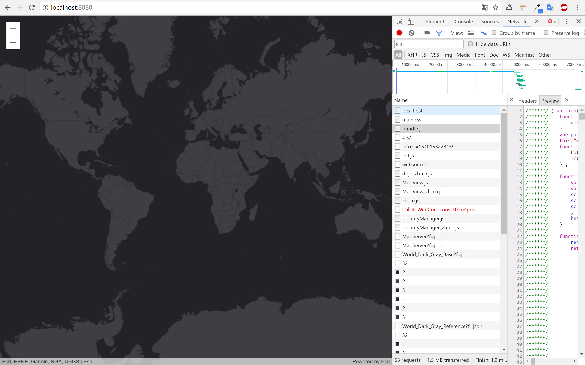

# React-Typescript-App-with-ArcGIS-JSAPI
## Effect

## Get
```shell
git clone https://github.com/guzhongren/React-Typescript-App-with-ArcGIS-JSAPI.git
```
## install 
```shell
cd React-Typescript-App-with-ArcGIS-JSAPI
npm install # yarn install
```
## run 
```shell
npm run start # yarn run start
```

## Other
1. About the ArcGIS JS API
  > You can config your local api follow the guide of offical document;
2. Component
  > You can package the EsriMapExt component to adapt to your busseness
